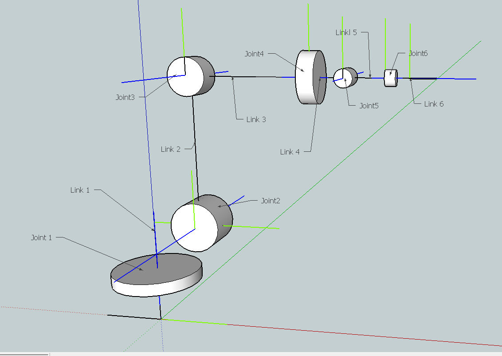
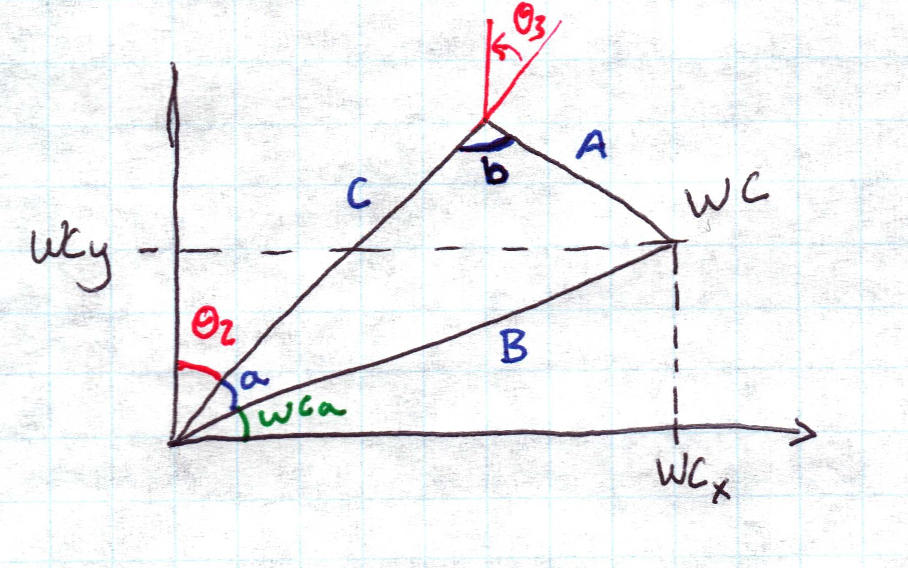
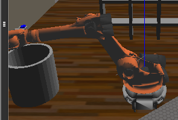
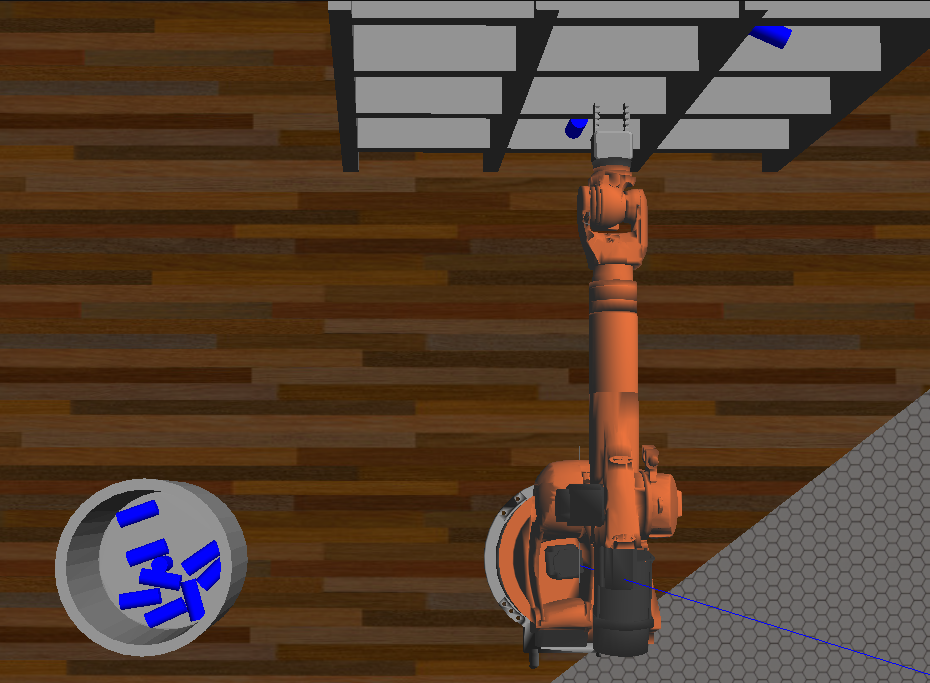

## Project: Kinematics Pick & Place
#### Submitted by Laura Eberhard

---

**Steps to complete the project:**  

1. Set up your ROS Workspace.
2. Download or clone the [project repository](https://github.com/udacity/RoboND-Kinematics-Project) into the ***src*** directory of your ROS Workspace.  
3. Experiment with the forward_kinematics environment and get familiar with the robot.
4. Launch in [demo mode](https://classroom.udacity.com/nanodegrees/nd209/parts/7b2fd2d7-e181-401e-977a-6158c77bf816/modules/8855de3f-2897-46c3-a805-628b5ecf045b/lessons/91d017b1-4493-4522-ad52-04a74a01094c/concepts/ae64bb91-e8c4-44c9-adbe-798e8f688193).
5. Perform Kinematic Analysis for the robot following the [project rubric](https://review.udacity.com/#!/rubrics/972/view).
6. Fill in the `IK_server.py` with your Inverse Kinematics code. 

## [Rubric](https://review.udacity.com/#!/rubrics/972/view) Points 

---
### Writeup / README

#### 1. Provide a Writeup / README that includes all the rubric points and how you addressed each one.  You can submit your writeup as markdown or pdf.  

This file will cover the rubric criteria and how item was addressed. The default README file was also altered to include a disclaimer about Udacity's honor code, since the project is in a public repository on github.

### Kinematic Analysis
#### 1. Run the forward_kinematics demo and evaluate the kr210.urdf.xacro file to perform kinematic analysis of Kuka KR210 robot and derive its DH parameters.

To determine the DH parameters, a diagram of the Kuka KR210 joints and links was created and the Z-axis of each joint was determined. 

At first each axis was placed with each joint, but it was realized that it would result in an increase in number of calculations. Since the course mentioned that axis can be moved to decrease the number of DH parameters, a new diagram was created. If an axis didn't change between between joints, the x or z axis for those joints were made collinear to simplify the parameter table.

After watching more videos and attempting to determine how the project kinematics 1 video assigned the axis locations. It was decided to continue with the diagram shown in the Project KR210 Forward Kinematics videos. The diagram below lists the axis along with the thetas for each joint.

The base (0) and joint 1 z-axis are collinear, while joints 2 and 3 are parallel. Joint 6 is also coliniear with the gripper (EE) z-axis. According to section 13 of the Forward and Inverse Kinematics lesson, collinlear lines in the Z axis mean alpha = 0 and a = 0. Parallel axis mean alpha is 0 and a is not 0. Intersecting Z axis will meant that alpha is not 0 and a = 0. Alpha values provided by the KR210 Forward Kinematics 1 video.

Links | alpha(i-1) | a(i-1) | d(i) | theta(i) | Notes
--- | --- | --- | --- | --- | ---
0->1 | 0 | 0 | ? | ? | Colinear: alpha & a = 0
1->2 | -90 | a1 | ? | ? | 
2->3 | 0 | a2 | ? | ? | Parallel: alpha = 0
3->4 | -90 | a3 | ? | ? | 
4->5 | 90 | 0 | ? | ? | Interset: a = 0
5->6 | -90 | 0 | ? | ? | Intersect: a = 0
6->G | 0 | 0 | ? | ? | Colinear: alpha & a = 0

The video in KR210 Forward Kinematics 1, shows which a's and d's need to be solved for with the DH table and supply the remaining alpha values. It is assumed that the rules of calculating d are the same as a, but with the X axis.

Links | alpha(i-1) | a(i-1) | d(i) | theta(i) | Notes
--- | --- | --- | --- | --- | ---
0->1 | 0 | 0 | d1 | ? |  Parallel: d != 0
1->2 | -90 | a1 | 0 | ? | Intersect: d = 0
2->3 | 0 | a2 | 0 | ? | Colinear: d = 0 
3->4 | -90 | a3 | d4 | ? |  Parallel: d != 0
4->5 | 90 | 0 | 0 | ? | Colinear: d = 0 
5->6 | -90 | 0 | 0 | ? | Colinear: d = 0 
6->G | 0 | 0 | dG | ? | Parallel: d != 0

The a and d variables were added to the diagram as seen below.

Finally, each of the joints are revolute, so the table would result in solving for each theta.

Links | alpha(i-1) | a(i-1) | d(i) | theta(i) | Notes
--- | --- | --- | --- | --- | ---
0->1 | 0 | 0 | d1 | Th1 |  
1->2 | -90 | a1 | 0 | Th2 | 
2->3 | 0 | a2 | 0 | Th3 | 
3->4 | -90 | a3 | d4 | Th4 |  
4->5 | 90 | 0 | 0 | Th5 | 
5->6 | -90 | 0 | 0 | Th6 |  
6->G | 0 | 0 | dG | ThG | 

#### 2. Using the DH parameter table you derived earlier, create individual transformation matrices about each joint. In addition, also generate a generalized homogeneous transform between base_link and gripper_link using only end-effector(gripper) pose.

Rotation The Th in the DH parameter table was replaced with q to follow the code examples.

Rn1 | Rn2 | Rn3 | T
--- | --- | --- | --- 
 cos(qi) | -sin(qi) | 0 | a(i-1) 
 sin(qi) * cos(alpha(i-1) | cos(qi) * cos(alpha(i-1) | -sin(alpha(i-1)) | -sin(alpha(i-1)) * di 
 sin(qi) * sin(alpha(i-1)) | cos(qi) * sin(alpha(i-1)) |  cos(alpha(i-1)) |  cos(alpha(i-1)) * di 
 0 | 0 | 0 | 1 

Alpha values were added in and the values calculated to simplify the transforms.

cos(-90), cos(90), sin(0) = 0
sin(90), cos(0) = 1
sin(-90) = -1

 

Frame 0 -> 1  Transform Formula w/ DH Parameter Variables

Rn1 | Rn2 | Rn3 | T
--- | --- | --- | --- 
cos(q1) | -sin(q1) | 0 | 0 
sin(q1) * cos(0) | cos(q1) * cos(0) | -sin(0) | -sin(0) * d1 
sin(q1) * sin(0) | cos(q1) * sin(0) |  cos(0) |  cos(0) * d1 
0 | 0 | 0 | 1 

Frame 0 -> 1  Values calculated

Rn1 | Rn2 | Rn3 | T
--- | --- | --- | --- 
cos(q1) | -sin(q1) | 0 | 0 
sin(q1) | cos(q1) | 0 | 0 
0 | 0 |  1 |  d1 
0 | 0 | 0 | 1 
 
Frame 0 -> 1 simplifies into a rotation matrix about the Z-axis (since joint 1 is aligned with the base) and a translation along the Z-xis.

Frame 1 -> 2  Transform Formula w/ DH Parameter Variables

Rn1 | Rn2 | Rn3 | T
--- | --- | --- | --- 
cos(q2) | -sin(q2) | 0 | a1 
sin(q2) * cos(-90) | cos(q2) * cos(-90) | -sin(-90) | -sin(-90) * 0 
sin(q2) * sin(-90) | cos(q2) * sin(-90) |  cos(-90) |  cos(-90) * 0 
0 | 0 | 0 | 1 
 
Frame 1 -> 2  Values calculated

Rn1 | Rn2 | Rn3 | T
--- | --- | --- | --- 
cos(q2) | -sin(q2) | 0 | a1 
0 | 0 | 1 | 0 
-sin(q2) | -cos(q2) |  0 |  0
0 | 0 | 0 | 1 
 
Frame 1 -> 2 simplifies into what appears to be a combination of the Z rotation and Y rotation. This because joint 2 is a rotation along the Y-axis in relation to joint 1. It also uses a transltaion along the X-axis. 
 

Frame 2 -> 3  Transform Formula w/ DH Parameter Variables

Rn1 | Rn2 | Rn3 | T
--- | --- | --- | --- 
cos(q3) | -sin(q3) | 0 | a2 
sin(q3) * cos(0) | cos(q3) * cos(0) | -sin(0) | -sin(0) * 0 
sin(q3) * sin(0) | cos(q3) * sin(0) |  cos(0) |  cos(0) * 0 
0 | 0 | 0 | 1 
 
Frame 2 -> 3  Values calculated

Rn1 | Rn2 | Rn3 | T
--- | --- | --- | --- 
cos(q3) | -sin(q3) | 0 | a2 
sin(q3) | cos(q3) | 0 | 0 
0 | 0 |  1 |  0 
0 | 0 | 0 | 1 

Frame 2 -> 3 simplifies into a rotation matrix about the Z-axis (since joint 2 is parallel to joint 3) and includes a translation along joint 2's x axis.

Frame 3 -> 4  Transform Formula w/ DH Parameter Variables

Rn1 | Rn2 | Rn3 | T
--- | --- | --- | --- 
cos(q4) | -sin(q4) | 0 | a3 
sin(q4) * cos(-90) | cos(q4) * cos(-90) | -sin(-90) | -sin(-90) * d4 
sin(q4) * sin(-90) | cos(q4) * sin(-90) |  cos(-90) |  cos(-90) * d4 
0 | 0 | 0 | 1 
 
Frame 3 -> 4  Values calculated

Rn1 | Rn2 | Rn3 | T
--- | --- | --- | --- 
cos(q4) | -sin(q4) | 0 | a3 
0 | 0 | 1 | d4 
-sin(q4) | -cos(q4) |  0 |  0 
0 | 0 | 0 | 1 

Frame 3 -> 4 simplifies into another rotation similar to frame 1 - > 2 and also inclues a translation along both the x and y axis. While it does not reflect the diagrammed joints, the assumption is that the optimizations from step 10 of the project are an accurate equivalent. If not, this will be evaluated first if the arm trajectory is off.

Frame 4 -> 5  Transform Formula w/ DH Parameter Variables

Rn1 | Rn2 | Rn3 | T
--- | --- | --- | --- 
cos(q5) | -sin(q5) | 0 | 0 
sin(q5) * cos(90) | cos(q5) * cos(90) | -sin(90) | -sin(90) * 0 
sin(q5) * sin(90) | cos(q5) * sin(90) |  cos(90) |  cos(90) * 0 
0 | 0 | 0 | 1 
 
Frame 4 -> 5  Values calculated

Rn1 | Rn2 | Rn3 | T
--- | --- | --- | --- 
cos(q5) | -sin(q5) | 0 | 0 
0 | 0 | -1 | 0 
sin(q5) | cos(q5) |  0 |  0 
0 | 0 | 0 | 1 

Frame 4 -> 5 simplifies into just a rotation similar to frame 3 -> 4, but without any translations and with different sign values.

Frame 5 -> 6  Transform Formula w/ DH Parameter Variables

Rn1 | Rn2 | Rn3 | T
--- | --- | --- | --- 
cos(q6) | -sin(q6) | 0 | 0 
sin(q6) * cos(-90) | cos(q6) * cos(-90) | -sin(-90) | -sin(-90) * 0 
sin(q6) * sin(-90) | cos(q6) * sin(-90) |  cos(-90) |  cos(-90) * 0 
0 | 0 | 0 | 1 

Frame 5 -> 6  Values calculated

Rn1 | Rn2 | Rn3 | T
--- | --- | --- | --- 
cos(q6) | -sin(q6) | 0 | 0 
0 | 0 | 1 | 0 
-sin(q6) | -cos(q6) |  0 | 0 
0 | 0 | 0 | 1 

Frame 5 -> 6 simplifies into a rotation similar to frame 4 -> 5, but with different sign values.

Frame 6 -> G  Transform Formula w/ DH Parameter Variables

Rn1 | Rn2 | Rn3 | T
--- | --- | --- | --- 
cos(qG) | -sin(qG) | 0 | 0 
sin(qG) * cos(0) | cos(qG) * cos(0) | -sin(0) | -sin(0) * dG 
sin(qG) * sin(0) | cos(qG) * sin(0) |  cos(0) |  cos(0) * dG 
0 | 0 | 0 | 1 

Frame 6 -> G  Values calculated

Rn1 | Rn2 | Rn3 | T
--- | --- | --- | --- 
cos(qG) | -sin(qG) | 0 | 0 
sin(qG) | cos(qG) | 0 | 0 
0 | 0 |  1 |  dGE 
0 | 0 | 0 | 1 

Frame 6 -> G simplifies into a standard rotation matrix about joint 6's Z-axis. It also adds in a translation along joint 6's Z-azis as well.

The jupyter python file "Frame Transformation Matrices" was added in to verify the individual frames. Lesson 11, section 17 was used to create this file and print the simplifications. Each matrix listed above was verified and the end effector was listed as 7 instead of G.

The end of step 10 in the project reported that the rotatiob between the base and the gripper is a 180 degree rotation about the z axis and a -90 degree rotation about the y axis. this can easily be shown in two rotation matrixes:

$$R_z = \matrix{ cos(180) & -sin(180) & 0\cr
               sin(180) & cos(180) & 0\cr
                       0 & 0 & 1}$$

$$R_y = \matrix{ cos(-90) & 0 & sin(-90)\cr
               0 & 1 & 0\cr
              -sin(-90) & 0 & cos(-90)}$$

#### 3. Decouple Inverse Kinematics problem into Inverse Position Kinematics and inverse Orientation Kinematics; doing so derive the equations to calculate all individual joint angles.

Following section 15 of the project, started with joint 5 solving for the Inverse Position. Joints 4, 5 and 6 meet the requirements for the "closed-form" solution.

Homogeneous transform: 
$$\matrix{l_x & m_x & n_x & p_x\cr l_y & m_y & n_y & p_y\cr l_z & m_z & n_z & p_z\cr 0 & 0 & 0 & 1\cr}$$

$$w_x = p_x - (d_6 + l) * n_x $$
$$w_y = p_y - (d_6 + l) * n_y $$
$$w_z = p_z - (d_6 + l) * n_z $$

Px, Py, Pz are end effector position
d6 from the DH table
l is end effector length
nx, ny, nz are the wrist center position

The remaining joints are diagrammed as follows based on Lesson 11, section 19.

Following the steps in lesson 11 section 19, the end effector is projected onto the ground plane and the solution for Joint 1 theta is 

$$\theta_1 = \atan2(y_c, x_C)$$

Joints 2 and 3 are calculated based on the supplied image from step 15 of the project. 

The diagram indicates \theta_2 can be found with 

$$A = d_4 from DH Parameters$$
$$B = \sqrt{WC_y^2 + WC_x^2}$$
$$C = a_2 from DH parameters$$

$$a = acos(\frac{B^2 + C^2 - A^2}{2 * B * C})$$

$$WCa = acos(\frac{WC_y^2 + B^2 - WC_x^2}{2 * WC_y * B})$$

$$\theta_2 = 90 - a - WCa$$

From the diagram in step 15, it seems like \theta_3 can be found with this:

$$b = acos(\frac{A^2 + C^2 - B^2}{2 * A * C})$$

$$\theta_3 = 90 - b$$

Section 15 indicates tgat 4, 5 and 6 can be found by taking the inverse of 0 through 3 and multiplying it with the end effector rotation matrix.

### Project Implementation

#### 1. Fill in the `IK_server.py` file with properly commented python code for calculating Inverse Kinematics based on previously performed Kinematic Analysis. Your code must guide the robot to successfully complete 8/10 pick and place cycles. Briefly discuss the code you implemented and your results. 

The forward kinematics code from the verification jupyter file "Frame Transformation Matrices", was copied over to IK_Server.py. This was part of following the instructions from step 12 of the project. 

There were challenges with the inverse kinematics calculations, so the walkthrough was used to help confirm the calculations along with a starting point for the code. After debugging, the error output was:

Wrist error for x position is: 0.05019708
Wrist error for y position is: 0.14993072
Wrist error for z position is: 0.43119765
Overall wrist offset is: 0.45927158 units

Theta 1 error is: 0.06239953
Theta 2 error is: 1.69407758
Theta 3 error is: 0.24293440
Theta 4 error is: 0.61891844
Theta 5 error is: 0.39334545
Theta 6 error is: 0.15850916

End effector error for x position is: 0.12241305
End effector error for y position is: 0.03599479
End effector error for z position is: 0.30304414
Overall end effector offset is: 0.32881048 units

On the first try, the arm did not grab the can. The arm still will not grab cans after updating the code to match the walkthrough. Errors  

Wrist error for x position is: 0.00000046
Wrist error for y position is: 0.12355227
Wrist error for z position is: 0.43697561
Overall wrist offset is: 0.45410664 units

Theta 1 error is: 0.04093002
Theta 2 error is: 0.02425885
Theta 3 error is: 0.21914260
Theta 4 error is: 0.66601961
Theta 5 error is: 0.37499318
Theta 6 error is: 0.29212958

End effector error for x position is: 0.02094135
End effector error for y position is: 0.01731642
End effector error for z position is: 0.06358249
Overall end effector offset is: 0.06914572 units 

It was noticed that samples 2 and 3 resulted in a 2, 3 error offset. Eventually the typo was found and the error offsets were below 1.0 for the sample datasets. It appears the calculations are having trouble with the bottom left shelf. After another pass with the walkthrough, additional typos were found.

When clicking continue, the arm was still not obtaining 8 out of 10 cans. Debugging statements were added to report the offset error and next was used to determine if the timing mentioned in the FAQ was the problem. The error offsets appeared to be within 0.5 on average and helped show that the code was actually calculating. It appeard that clicking next in the middle of the arm movement could cause cans to be dropped.

8 out of 10 cans were picked up using the next button and the debugging statements. Some rotation matrix optimizations were removed in case they affected the results as well. Clicking continue instead of the Next button results in the software hanging up or the can is left on the shelf. The suspicion is that the FAQ time fix is not working on this virtual machine. The time is returned to 5 seconds, but the code still hangs on occassion when there are several lists of end effectors lists longer than 40. It is suspected that this is a limitation of the resources available to the virtual machine since it becomes more frequent until the VM is restarted. After re-starting the VM and a successful 8 out of 10 with the continue button, it was realized that this only happens when the computer is put into sleep overnight between runs.

Improvements could be made to the joint calculations of joints 4, 5 and 6 since the gripper appears to rotate excessivly. Optimizations should be made so the arm movements do not become less efficient with each click of the continue button. 

